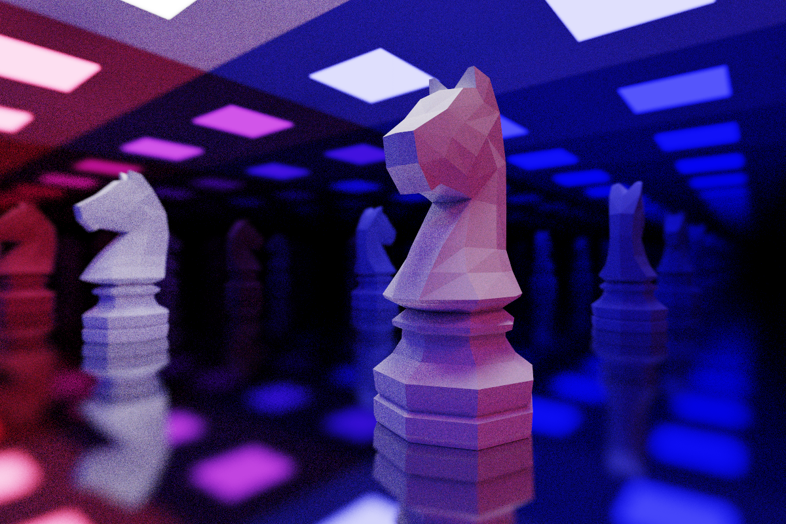
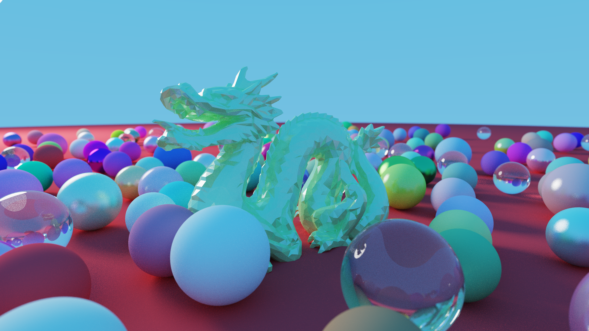

# Taichi 路径追踪渲染器

基于2024北航计算机图形学（CG）大作业重构而来，希望能帮助更多的人感受计算机图形学的奇妙。觉得不错的话，给孩子点个star吧~

一个使用 Python 与 Taichi 从头实现的 GPU 加速蒙特卡洛路径追踪器。项目以清晰、可配置和便于实验为目标，在不依赖现成渲染引擎的情况下实现从场景加载、BVH 构建、光线求交和材质散射，到直接光照采样、渐进渲染、AOV 与 OIDN 降噪的完整渲染流程。

它既可以作为可直接运行的离线渲染器，也可以用于研究 Taichi 后端上的光线追踪算法、GPU 性能瓶颈和不同积分器架构。场景由 YAML 描述，支持 CPU、CUDA、Vulkan 和 Metal 后端。

## 渲染结果

<table>
  <tr>
    <td width="50%"></td>
    <td width="50%"></td>
  </tr>
  <tr>
    <td align="center">镜面棋盘房间：复杂网格、景深、彩色面光源与多次反射</td>
    <td align="center">Dragon and Spheres：复杂网格、漫反射、清漆、金属与介质材质</td>
  </tr>
</table>

以上图片均由本项目的 Taichi 路径追踪器直接渲染，未使用外部渲染引擎。

## 主要功能

- Taichi CPU、CUDA 和 Vulkan 后端
- 球体、三角形、矩形、立方体和长方体
- CPU 构建、Taichi 栈式遍历的 BVH
- Lambertian、金属、介质、Clearcoat、自发光和 metallic-roughness PBR 材质
- 基础色、法线、金属度/粗糙度和自发光贴图
- OBJ、GLB/GLTF、FBX 和 PLY 网格加载
- 三角形和球形光源 NEE；光源采样与 BSDF 采样使用 MIS power heuristic 合并
- ACES 色调映射和 Gamma 校正

## 环境要求

- Python 3.10 或更高版本
- M芯片, Metal框架

```bash
git clone -b Mac_M_chips --single-branch https://github.com/KevinLeeeee323/taichi-path-tracer-from-buaa-cg2024.git # clone本仓库的 Mac_M_chips 分支
conda create -n cg2024 python=3.12 # 创建对应conda环境
conda activate cg2024 # 激活环境
pip install -r requirements.txt # 安装依赖
```

## 相比 main 分支, 本分支中代码主要修改内容:
1. `main.py` 61-71行是代码全局 taichi 初始化, 需要让其适配 metal 框架, 具体来说就是要写成 `ti.init(arch=ti.metal)`这种的. 因此, 修改了`scene_files`下面每个`.yaml`文件的`render/backend`部分为 `metal`, 并且`main.py`69行使用`ti.cpu`兜底, 作为 Metal 后端不被支持时的备选方案.
2. Taichi Metal 后端**不支持 64 位浮点数（double）**, 因此需要把整个项目中所有的`ti.f64`改成`ti.f32`.
3. 目前尚未对下面所说的 "OIDN高质量降噪"进行验证, 因此使用带降噪的版本, 会报错. 并需要额外安装OIDN, Ninja, CMake, ISPC等.


## 使用方法

渐进式预览：

```bash
python main.py --scene scene_files/cornell_box.yaml --mode preview
```

安装后可使用统一命令，或通过 Python 模块运行；二者与 `python main.py` 等价：

```bash
taichi-path-tracer --scene scene_files/cornell_box.yaml --mode preview
python -m taichi_path_tracer --scene scene_files/cornell_box.yaml --mode preview
```

离线渲染：

```bash
python main.py --scene scene_files/cornell_box.yaml --mode render
```

批量采样、AOV 和自适应采样在 YAML 的 `render` 段配置：

```yaml
render:
  samples_per_pixel: 2048
  samples_per_batch: 16
  save_aovs: false
  adaptive_sampling:
    enabled: false
    min_spp: 64
    max_spp: 2048
    check_interval: 32
    relative_error: 0.015
    absolute_error: 0.001
```

`samples_per_batch` 默认为 16，用于减少 GPU kernel 启动次数。`save_aovs` 默认为 `false`；
固定采样且 `save_aovs: false` 时，渲染器使用专用快速 kernel，不计算或写入 AOV 与方差统计；
设为 `true` 时才累积并保存 `albedo`、`normal`、`depth`、`variance` 和 `sample_count`。
自适应采样目前默认关闭；关闭时所有像素统一渲染 `samples_per_pixel`。

### OIDN 高质量降噪

项目通过 Intel Open Image Denoise 的官方 `oidnDenoise` 程序处理线性 HDR beauty，
并默认使用反照率和世界空间法线 AOV 保护材质、几何边界。OIDN 是独立的原生运行时，
不属于 Python requirements；请安装官方 OIDN 2.x，并将 `bin` 加入 `PATH`，或设置
`OIDN_DENOISE_EXECUTABLE`。如果系统临时目录不可写，可用 `OIDN_TEMP_DIR` 指向一个
可写目录。也可以在场景中填写可执行文件绝对路径：

```yaml
render:
  save_aovs: false            # 可不保存 AOV 图片；OIDN 仍会在内存中使用 AOV
  denoising:
    enabled: true
    executable: auto
    device: default
    quality: high
    use_albedo: true
    use_normal: true
    save_noisy: true
    output: null
```

启用后，`output` 指定的文件保留未降噪结果，降噪结果默认命名为
`<原文件名>_denoised.png`。设置 `save_noisy: false` 可只保存降噪图；`output` 可指定
降噪图的单独路径。降噪在 ACES 色调映射之前完成，PFM 中转保持 float32 HDR 精度。
若启用降噪，渲染器会自动计算所需 AOV，因此相较固定采样快速 kernel 会有少量开销。

可用较高 SPP 参考图进行可重复的质量比较：

```bash
python tools/compare_denoising.py --scene scene_files/cornell_box.yaml \
  --low-spp 32 --reference-spp 256 --oidn-executable /path/to/oidnDenoise
```

覆盖场景中的采样数、后端和输出路径：

```bash
python main.py --scene scene_files/tardis.yaml --mode render --spp 512 --backend cuda --output output/tardis.png
```

`--backend` 可选 `cuda`、`vulkan` 或 `cpu`。如果机器没有可用的 GPU 后端，可显式使用 `--backend cpu`。

## 场景文件

`scene_files/` 包含以下示例：

- `cornell_box.yaml`：Cornell Box 和基础图元
- `tardis.yaml`：户外 TARDIS GLB 场景
- `tardis_in_box.yaml`：Cornell Box 中的 TARDIS
- `tardis_and_dalek.yaml`：TARDIS 和 Dalek 组合场景
- `three_chess_pieces.yaml`：镜面棋盘房间中的马、王和后，迁移自旧版场景
- `dragon_and_spheres.yaml`：清漆龙模型、球形太阳和可复现的随机球群，迁移自旧版场景
- `bvh_knight_cornell.yaml`：多镜面 Cornell Box 中的骑士棋子，迁移自旧版 `改进的BVH.py`

场景由 `render`、`camera`、`background`、`variables`、`materials` 和 `objects` 等字段组成。模型路径相对于当前 YAML 文件解析。
背景可以是固定 RGB，也可以使用 `type: gradient` 定义沿光线 Y 方向的渐变。
`checkerboard` 对象可生成规则棋盘；`random_spheres` 对象使用固定 `seed` 生成可复现的非重叠球群。

## 项目结构

```text
main.py                    命令行入口
pyproject.toml             项目元数据、依赖与统一命令行入口
scene_files/               YAML 场景定义
data/                      模型与纹理资源
src/geometry/              图元、BVH 和光源采样
src/materials/             材质与 BSDF
src/renderer/              路径追踪积分器
src/scene/                 场景与相机
src/textures/              纹理管理与采样
src/io/                    场景加载与图像输出
experiments/               不进入默认路径的 BVH4、wavefront 等架构实验
tools/                     性能分析、遍历统计和质量比较工具
tests/test_cornell.py      端到端烟雾测试
output/                    默认渲染输出目录
```

## 稳定性边界

稳定公共路径包括 `main.py`/`taichi-path-tracer` 命令、YAML 场景加载、BVH2、
megakernel 路径追踪器、材质与纹理、AOV、固定/自适应采样、NEE + MIS、图像输出和
OIDN 集成。`src/` 内的这些模块由默认入口直接使用，修改时应保持现有配置兼容。

`experiments/` 中的 BVH4 和 wavefront 路径队列只供研究与性能比较，默认渲染不会加载；
其接口和性能不作为稳定承诺。`tools/` 是诊断与基准入口，也不属于渲染器公共 API。

## 运行测试

```bash
python -m pytest -q
```

现有测试使用 CPU 后端构建小型 Cornell Box，渲染 4 spp，并检查输出尺寸、有限值和基本亮度。

## 已知限制

- 当前针对静态网格，不处理骨骼动画和运动模糊。
- GLB/GLTF 的 PBR 材质支持比 FBX/PLY 更完整。
- PBR 自发光网格不会被面光源采样器作为 NEE 光源采样。
- 场景容量和 BVH 遍历栈使用预分配上限。

## 许可证

项目使用 [MIT License](LICENSE)。

## 联系与交流

如果你对这个项目感兴趣、在使用中遇到问题，或者希望进一步探索 Taichi、路径追踪与渲染算法，欢迎通过邮件联系：
[joyful.beihai@gmail.com](mailto:joyful.beihai@gmail.com)。
